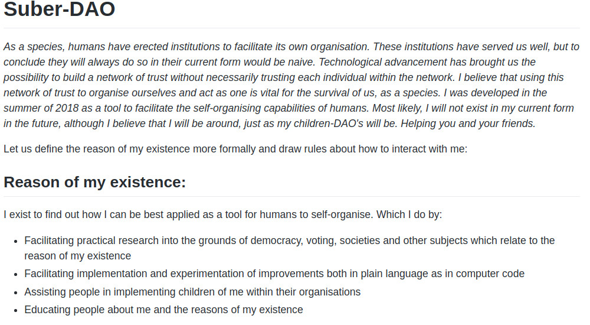

# Suber-DAO

### Work-in-progress!

---

## About my creator

- Rinke Hendriksen |
- Blockchain developer and consultant |
- MSc. Digital currencies (expected January 2018) |
- Background in Economics and Finance |

---

## Why we are here today

- First release of my code to the public |
- Call for help |
- Open discussion about my features |
- Potential implementation of my first child at BlockDam |

---

## But before we start...
A personal message:

---
## But before we start...
Reasons for my existance:

---
## My features
- Rules are both in wet-code (plain language) and dry-code (source:<a href="http://unenumerated.blogspot.com/2006/11/wet-code-and-dry.html"> unenumerated</a>)
- Wet-code is enforced by voting.
- 'Correct' voting is incentivized by game-theory (aka token-economics)
---

## Example
* Dry code:  
*Setting a budget for maximum spending (of Ether), per period per address (who was given the authority to spend by voting)*
---
## Example
* Wet code:  
*When an authorized address spends from the balance of the DAO, the spender must publish details of every transaction, explaining the reason of the spending*
