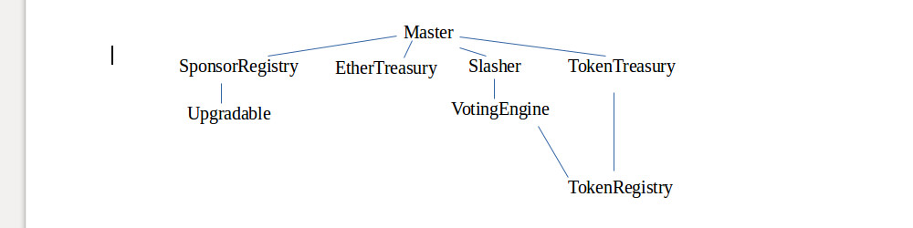

# Suber-DAO

### Work-in-progress!

---

## About my creator
- Rinke Hendriksen |
- Blockchain developer and consultant |
- MSc. Digital currencies (expected January 2018) |
- Background in Economics and Finance |

---

## Why we are here today
- First release of my code to the public |
- Call for help |
- Open discussion |

---

## But before we start...
A personal message:

---
## But before we start...
Reasons for my existance:

---
## My features
- Rules are both in wet-code (plain language) and dry-code (source:<a href="http://unenumerated.blogspot.com/2006/11/wet-code-and-dry.html"> unenumerated</a>)
- Wet-code is enforced by voting |
- 'Correct' voting is incentivized by game-theory (aka token-economics) |
---

## My features (example)
* Dry code:  
*Setting a budget for maximum spending (of Ether), per period per address (who was given the authority to spend by voting)*
---
## My features (example)
* Wet code:  
*When an authorized address spends from the balance of the DAO, the spender must publish details of every transaction, explaining the reason of the spending*
---

## My features (Continuation)
- Rules are both in wet-code (plain language) and dry-code (source:<a href="http://unenumerated.blogspot.com/2006/11/wet-code-and-dry.html"> unenumerated</a>)
- Wet-code is enforced by voting
- 'Correct' voting is incentivized by game-theory (aka token-economics)
- Which allows changing all parameters (for example: default budget / budget period) |
- Which makes the contract itself fully upgradable, both on-chain and across blockchains |
---

## Overview of contracts

---

## I am live!
See: github.com/Eknir/Suber-DAO
---

## Call for help
I need:
* Critical people, to discuss my initial set-up |
* Web-developers, to help creating my user-interface |
* Lawyers, or other people capable of creating my wet-code |
* Experienced Solidity developers, to audit my dry-code |
* Supporters! :) |
* Please reach out to me on Github |
---

## Open discussion
Ask me Anything!
